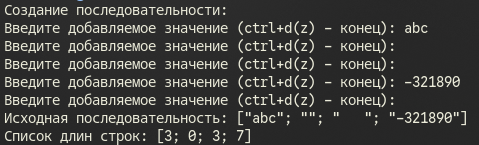
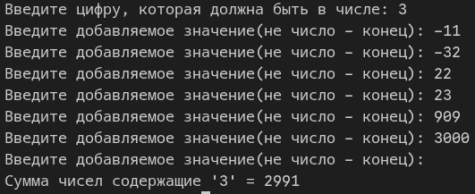
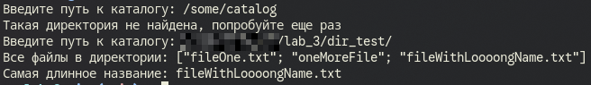

# Лабораторная №3

# Задание 1. Seq.map

## Задача 4

### Текст задачи

Найти сумму тех элементов последовательности, в которых встречается заданная цифра.

### Описание логики работы
В программе сначала создается последовательность, путем вызова рекурсивной функции, которая запрашивает добавляемое значение у пользователя:
* если ввод равен null (Ctrl+D), возвращается последовательность 
* иначе рекурсивно вызываем эту функцию, добавляя текущее введенное значение в последовательность 

Далее программа создает новую последовательность, проходя по каждому значению созданной последовательности функцией, которая возвращает количество символов элемента через.

### Тестирование

- - -

# Задание 2. Seq.fold

## Задача 4

### Текст задачи

Найти сумму тех элементов последовательности, в которых встречается заданная цифра.

### Описание логики работы

В начале мы запрашиваем у пользователя цифру, которую будем искать в каждом числе последовательности.

Далее в программе создается последовательность, путем вызова рекурсивной функции, которая запрашивает добавляемое значение у пользователя:
* если это не число, генерация последовательности завершается 
* иначе введенное число добавляется в последовательность, и функция вызывается рекурсивно 

Потом программа проходит по всем элементам последовательности с помощью , используя функцию, которая проверяет каждое значение на наличие в нем цифры через рекурсивную функцию (она поэтапно сравнивает остаток от деления на 10 с заданной цифрой):
* Если цифра найдена, то мы возвращаем текущую сумму (аккумулятор) плюс значение самого элемента 
* иначе мы просто возвращаем текущее значение аккумулятора 

### Тестирование

- - -

# Задание 3. Seq.fold

## Задача 4

### Текст задачи

Вывести самое длинное название файла в указанном каталоге.

### Описание логики работы

В программе запрашивается путь к каталогу, после чего проверяется его существование. Если директория найдена, создается последовательность файлов в каталоге:
* к каждому элементу применяется функция, которая обрезает полный путь, оставляя только название файла 
* если директория не найдена, функция вызывается рекурсивно для повторного ввода 

Затем программа проходит по всем элементам с функцией, которая сравнивает длину текущего элемента с длиной строки в аккумуляторе:
* если текущее название длиннее, оно становится новым значением аккумулятора 
* иначе аккумулятор остается прежним 

По итогу выводится самое длинное название файла из данной директории.

### Тестирование

